# Informe – Laboratorio 3.2: Infraestructura de Red de una Organización con VLANs

**Universidad San Francisco Xavier de Chuquisaca**
**Asignatura:** Infraestructura, Plataformas Tecnológicas y Redes (SIS313)
**Docente:** Ing. Marcelo Quispe Ortega
**Estudiante:** Ivan Jairo Castillo Paco
**Semestre:** 2/2026
**Fecha:** 17/09/2026
**Alcance:** Práctica guiada (Pasos 1 al 4)

---

## 1. Objetivo

Implementar una red empresarial segmentada con VLANs, usando un router Linux (Ubuntu Server 24.04) que realiza el enrutamiento inter-VLAN, el acceso a internet mediante NAT y el control de tráfico entre departamentos con UFW. En la práctica guiada se configuran el router y los departamentos de **Contabilidad (VLAN 40)** y **Ventas (VLAN 30)**, y se verifican las políticas de acceso.

---

## 2. Entorno de trabajo

| Elemento | Detalle |
|---|---|
| Sistema anfitrión | Debian 13 (Trixie) |
| Hipervisor | Oracle VirtualBox |
| Router | Ubuntu Server 24.04 LTS |
| Clientes | Alpine Linux (edición *virt*) |
| Red interna (switch virtual) | `lab32` |


### 2.1 Direccionamiento

| Máquina | Departamento | VLAN | IP | Máscara | Gateway |
|---|---|---|---|---|---|
| Router (`vlan10`) | – | 10 | 192.168.10.1/29 | 255.255.255.248 | – |
| Router (`vlan20`) | – | 20 | 192.168.20.1/29 | 255.255.255.248 | – |
| Router (`vlan30`) | – | 30 | 192.168.30.1/27 | 255.255.255.224 | – |
| Router (`vlan40`) | – | 40 | 192.168.40.1/29 | 255.255.255.248 | – |
| PC-Ventas | Ventas | 30 | 192.168.30.2 | 255.255.255.224 | 192.168.30.1 |
| PC-Contabilidad | Contabilidad | 40 | 192.168.40.2 | 255.255.255.248 | 192.168.40.1 |

### 2.2 Configuración de red en VirtualBox

**Router:**
- Adaptador 1 → NAT (acceso a internet). Reenvío de puertos `127.0.0.1:2222 → 22` para administrarlo por SSH desde el anfitrión.
- Adaptador 2 → Red interna `lab32`, modo promiscuo "Permitir todo". Funciona como **trunk**, es decir, transporta las tramas etiquetadas de todas las VLANs.

**Clientes Alpine:**
- Adaptador 1 → Red interna `lab32`, modo promiscuo "Permitir todo".

Para las VMs Alpine se creó primero una máquina base conectada por NAT, donde se instalaron los paquetes `nano`, `vlan` y `openssh`. Luego se clonó generando **nuevas direcciones MAC**, y cada clon se conectó a la red interna `lab32`.

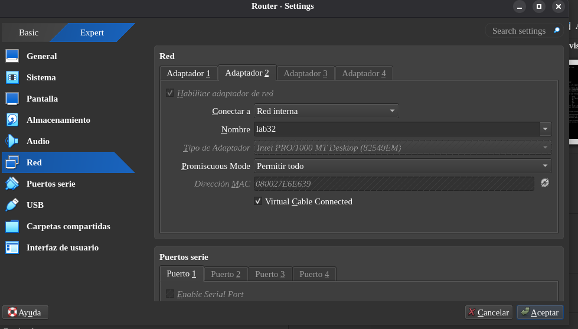

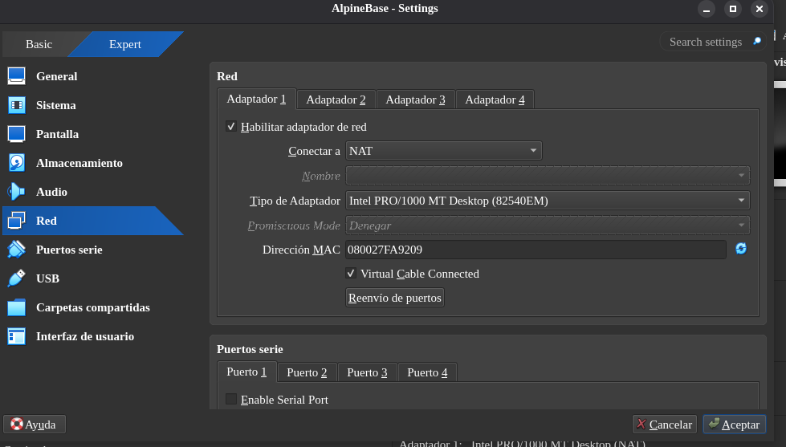

---

## 3. Paso 1 – Configuración de VLANs y router

### 3.1 Herramientas VLAN y módulo del kernel

```bash
sudo apt install -y vlan tcpdump
sudo modprobe 8021q
echo 8021q | sudo tee -a /etc/modules
lsmod | grep 8021q
```

El módulo `8021q` implementa el estándar IEEE 802.1Q, que permite etiquetar tramas Ethernet con un identificador de VLAN. Se agregó a `/etc/modules` para que cargue en cada arranque.

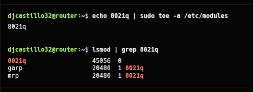

### 3.2 Sub-interfaces VLAN con Netplan

Para que cloud-init no sobrescriba la configuración de red, se desactivó su gestión de red:

```bash
echo "network: {config: disabled}" | sudo tee /etc/cloud/cloud.cfg.d/99-disable-network-config.cfg
```

Archivo `/etc/netplan/50-cloud-init.yaml`:

```yaml
network:
  version: 2
  ethernets:
    enp0s3:
      dhcp4: true
    enp0s8:
      dhcp4: no
      optional: true
  vlans:
    vlan10:
      link: enp0s8
      id: 10
      addresses:
        - 192.168.10.1/29
      nameservers:
        addresses: [8.8.8.8]
    vlan20:
      link: enp0s8
      id: 20
      addresses:
        - 192.168.20.1/29
      nameservers:
        addresses: [8.8.8.8]
    vlan30:
      link: enp0s8
      id: 30
      addresses:
        - 192.168.30.1/27
      nameservers:
        addresses: [8.8.8.8]
    vlan40:
      link: enp0s8
      id: 40
      addresses:
        - 192.168.40.1/29
      nameservers:
        addresses: [8.8.8.8]
```

```bash
sudo chmod 600 /etc/netplan/50-cloud-init.yaml
sudo netplan generate
sudo netplan apply
```

Cada sub-interfaz (`vlan10`, `vlan20`, `vlan30`, `vlan40`) cuelga de la interfaz física `enp0s8`, que actúa como trunk. La IP de cada sub-interfaz es el **gateway** de su VLAN, y así el router hace el enrutamiento inter-VLAN (esquema *router-on-a-stick*).

**Verificación:**

```bash
ip -br a
sudo cat /proc/net/vlan/config
```

Resultado: las cuatro interfaces `vlan10@enp0s8`, `vlan20@enp0s8`, `vlan30@enp0s8` y `vlan40@enp0s8` están en estado `UP` con sus IPs, y `/proc/net/vlan/config` confirma los IDs 10, 20, 30 y 40 sobre `enp0s8`.

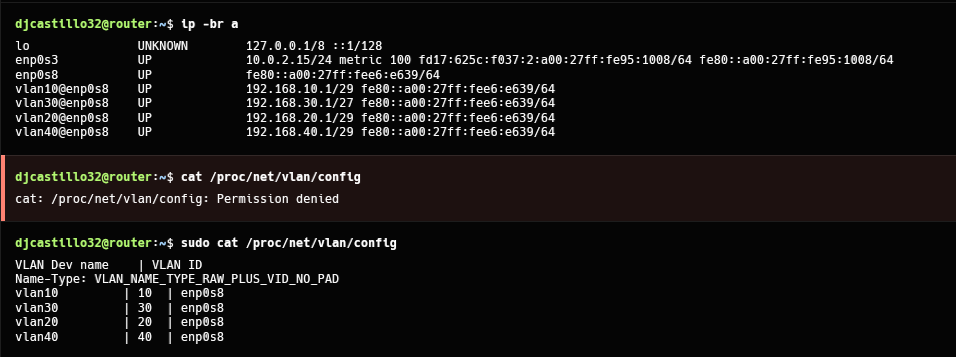

```bash
ip route
ping -c 3 8.8.8.8
```

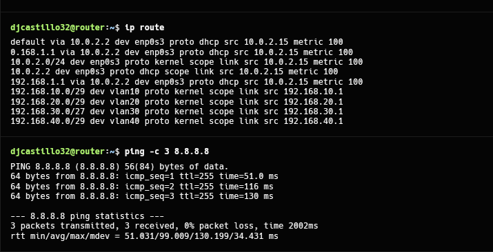

### 3.3 Reenvío de paquetes (ip_forward)

En `/etc/sysctl.conf` se descomentó:

```
net.ipv4.ip_forward=1
```

```bash
sudo sysctl -p
sysctl net.ipv4.ip_forward
```

Además, se descomentó `net/ipv4/ip_forward=1` en `/etc/ufw/sysctl.conf`, para que UFW no revierta este valor al iniciar.

Sin esta opción, el kernel descarta los paquetes que llegan por una interfaz y deben salir por otra, y el equipo no funcionaría como router.

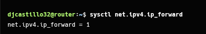

---

## 4. Paso 2 – VM de Contabilidad (VLAN 40)

Archivo `/etc/network/interfaces`:

```
auto lo
iface lo inet loopback

auto eth0.40
iface eth0.40 inet static
    address 192.168.40.2
    netmask 255.255.255.248
    gateway 192.168.40.1
    vlan-id 40

auto eth0
iface eth0 inet manual
    up ip link set $IFACE up
    down ip link set $IFACE down
```

```sh
echo "PC-Contabilidad" > /etc/hostname
echo "nameserver 8.8.8.8" > /etc/resolv.conf
reboot
```

La interfaz física `eth0` solo se levanta, sin IP. La sub-interfaz `eth0.40` etiqueta el tráfico con el ID 40 y tiene la IP estática con máscara /29 y como gateway al router.

**Verificación:**

```sh
ip a
ip route
ping -c 3 192.168.40.1
```

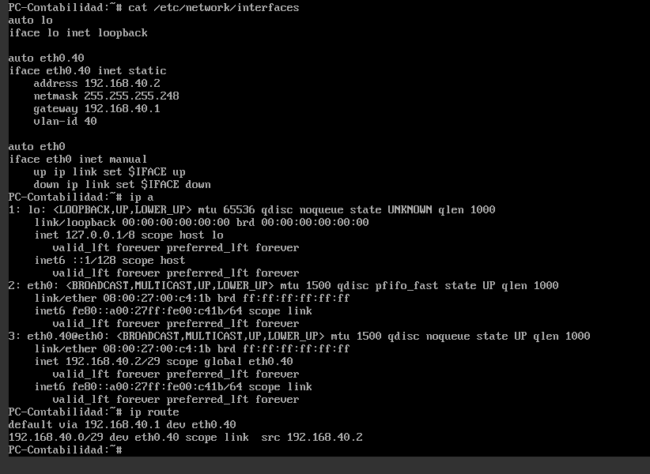

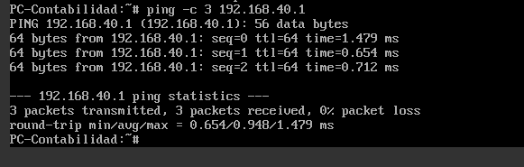

---

## 5. Paso 3 – VM de Ventas (VLAN 30)

Archivo `/etc/network/interfaces`:

```
auto lo
iface lo inet loopback

auto eth0.30
iface eth0.30 inet static
    address 192.168.30.2
    netmask 255.255.255.224
    gateway 192.168.30.1
    vlan-id 30

auto eth0
iface eth0 inet manual
    up ip link set $IFACE up
    down ip link set $IFACE down
```

```sh
echo "PC-Ventas" > /etc/hostname
echo "nameserver 8.8.8.8" > /etc/resolv.conf
reboot
```

**Verificación:**

```sh
ip a
ip route
ping -c 3 192.168.30.1
```

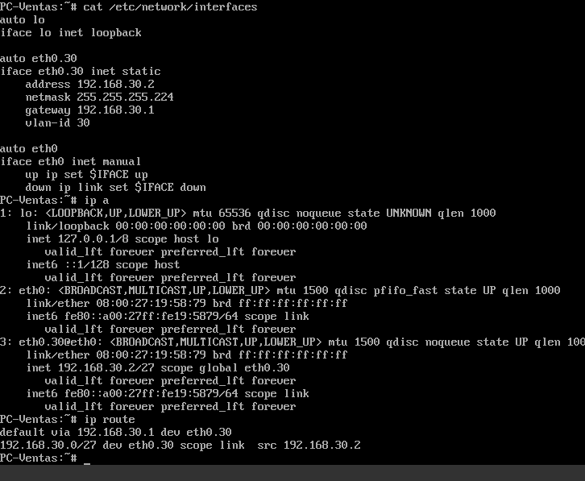

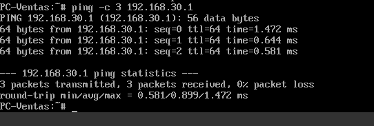

### 5.1 Tramas etiquetadas en el trunk

Desde el router, mientras se hacía ping desde un cliente:

```bash
sudo tcpdump -eni enp0s8 vlan
```

La captura muestra tramas con la etiqueta `vlan 40` (o `vlan 30`). Esto confirma que el enlace `enp0s8` transporta tráfico 802.1Q etiquetado.

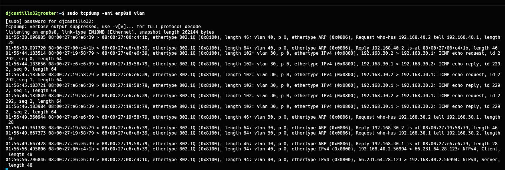

---

## 6. Paso 4 – Firewall UFW en el router

### 6.1 Políticas por defecto

```bash
sudo ufw default deny incoming
sudo ufw default allow outgoing
sudo ufw default deny routed
sudo ufw allow ssh
sudo ufw enable
```

| Política | Efecto |
|---|---|
| `deny incoming` | Bloquea el tráfico dirigido al propio router, salvo lo permitido explícitamente (SSH). |
| `allow outgoing` | El router puede iniciar conexiones hacia afuera. |
| `deny routed` | **Todo el tráfico que atraviesa el router (entre VLANs o hacia internet) se bloquea por defecto.** Solo pasa lo que una regla `route allow` permite. |
| `allow ssh` | Permite administrar el router por SSH sin perder la conexión al activar UFW. |

UFW acepta automáticamente las respuestas de conexiones ya establecidas (`RELATED,ESTABLISHED` en `before.rules`). Por eso basta con permitir el sentido en que se inicia la conexión.

### 6.2 Reglas entre VLANs

| # | Regla | Acción | Explicación |
|---|---|---|---|
| 1 | `route allow in on vlan20 out on vlan10` | Permitir | TI puede acceder a la DMZ |
| 2 | `route allow in on vlan20 out on vlan30` | Permitir | TI puede acceder a Ventas |
| 3 | `route allow in on vlan20 out on vlan40` | Permitir | TI puede acceder a Contabilidad |
| 4 | `route allow in on vlan30 out on vlan10` | Permitir | Ventas puede acceder a la DMZ |
| 5 | `route allow in on vlan40 out on vlan10` | Permitir | Contabilidad puede acceder a la DMZ |
| 6 | `route allow in on vlan40 out on vlan30` | Permitir | Contabilidad puede acceder a Ventas |
| 7 | `route deny in on vlan10 out on vlan20` | Denegar | La DMZ no puede iniciar conexiones hacia TI |
| 8 | `route deny in on vlan10 out on vlan30` | Denegar | La DMZ no puede iniciar conexiones hacia Ventas |
| 9 | `route deny in on vlan10 out on vlan40` | Denegar | La DMZ no puede iniciar conexiones hacia Contabilidad |
| 10 | `route deny in on vlan30 out on vlan20` | Denegar | Ventas no puede acceder a TI |
| 11 | `route deny in on vlan30 out on vlan40` | Denegar | Ventas no puede acceder a Contabilidad |
| 12 | `route deny in on vlan40 out on vlan20` | Denegar | Contabilidad no puede acceder a TI |

`in on` indica la interfaz por la que **entra** el paquete, es decir, la VLAN de origen. `out on` indica la interfaz por la que **sale**, es decir, la VLAN de destino.

### 6.3 Reglas de salida a internet

| # | Regla | Acción | Explicación |
|---|---|---|---|
| 13 | `route allow in on vlan20 out on enp0s3` | Permitir | TI tiene acceso a internet |
| 14 | `route allow in on vlan40 out on enp0s3` | Permitir | Contabilidad tiene acceso a internet |
| 15 | `route deny in on vlan10 out on enp0s3` | Denegar | La DMZ no tiene acceso a internet |
| 16 | `route deny in on vlan30 out on enp0s3` | Denegar | Ventas no tiene acceso a internet |

**Observación:** la guía del laboratorio solo incluye el enmascaramiento (NAT). Como la política por defecto para tráfico enrutado es `deny routed`, los paquetes de TI y Contabilidad hacia `enp0s3` se descartaban antes de llegar al NAT. Por eso se agregaron las reglas 13 y 14. Las reglas 15 y 16 no son estrictamente necesarias, porque la política por defecto ya bloquea ese tráfico, pero se agregaron para que la política quede explícita y visible en `ufw status`.

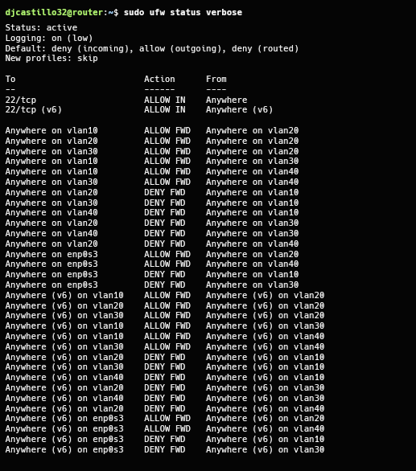

### 6.4 Enmascaramiento (NAT)

Al inicio de `/etc/ufw/before.rules`, antes de la sección `*filter`:

```
*nat
:POSTROUTING ACCEPT [0:0]
-A POSTROUTING -s 192.168.20.0/24 -o enp0s3 -j MASQUERADE
-A POSTROUTING -s 192.168.40.0/24 -o enp0s3 -j MASQUERADE
COMMIT
```

```bash
sudo ufw reload
sudo iptables -t nat -L POSTROUTING -n -v
```

`MASQUERADE` reemplaza la IP privada de origen (192.168.20.x o 192.168.40.x) por la IP de `enp0s3` (10.0.2.15). Así las respuestas de internet regresan al router, y este las devuelve al cliente correcto. Solo se aplica a TI y Contabilidad; Ventas y la DMZ no tienen regla de NAT.

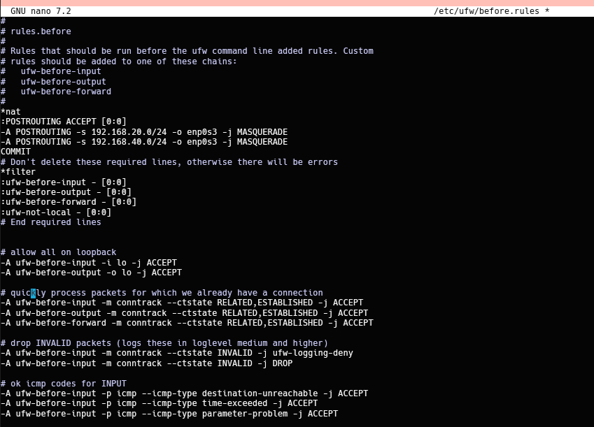

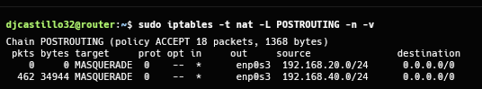

---

## 7. Pruebas de conectividad

| # | Origen | Prueba | Resultado esperado | Resultado obtenido |
|---|---|---|---|---|
| 1 | Contabilidad | `ping -c 3 8.8.8.8` | Responde | ✅ 3/3 paquetes, 0% de pérdida |
| 2 | Contabilidad | `ping -c 3 google.com` | Responde | ✅ 3/3 paquetes, 0% de pérdida |
| 3 | Contabilidad | `ssh root@192.168.30.2` (Ventas) | Permitido | ✅ Acceso concedido |
| 4 | Ventas | `ping -c 3 -W 2 8.8.8.8` | Sin respuesta | ✅ 100% de pérdida |
| 5 | Ventas | `ping -c 3 -W 2 google.com` | Falla | ✅ No resuelve / sin respuesta |
| 6 | Ventas | `ssh -o ConnectTimeout=5 root@192.168.40.2` (Contabilidad) | Denegado | ✅ `Operation timed out` |

### 7.1 Acceso a internet desde Contabilidad

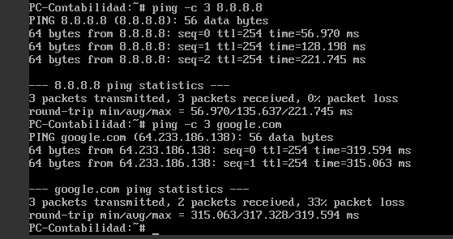

### 7.2 Contabilidad accede por SSH a Ventas

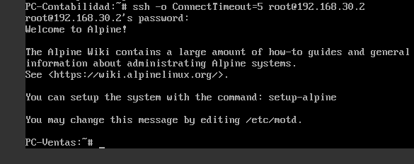

### 7.3 Ventas sin acceso a internet

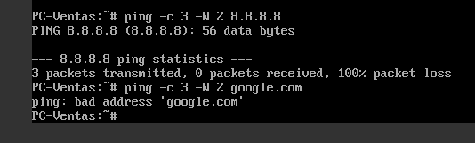

### 7.4 Ventas no puede acceder a Contabilidad

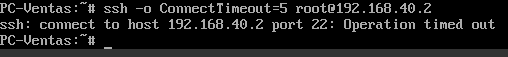

Una conexión denegada produce `Operation timed out`: UFW descarta el paquete en silencio (DROP), sin enviar respuesta de rechazo.

---

## 8. Problemas encontrados y soluciones

| Problema | Causa | Solución |
|---|---|---|
| Aviso "Mirror check still running" al instalar Ubuntu | El instalador aún verificaba el repositorio | Se esperó a que la prueba del mirror terminara antes de continuar |
| `Failed unmounting cdrom.mount` al finalizar la instalación | La ISO seguía montada en la unidad virtual | Se expulsó el disco desde *Dispositivos → Unidades ópticas* y se presionó Enter |
| `REMOTE HOST IDENTIFICATION HAS CHANGED` al conectar por SSH al router | El puerto 2222 había sido usado antes por otra VM | Se eliminó la huella anterior con `ssh-keygen -R '[127.0.0.1]:2222'` |
| Las VMs Alpine no podían instalar paquetes en la red interna | La red interna no tiene acceso a internet | Se creó una VM base con NAT, se instalaron los paquetes y luego se clonó |
| `Permission denied` al leer `/proc/net/vlan/config` | El archivo solo es legible por root | Se usó `sudo` |
| Sin internet en Contabilidad aun con NAT configurado | La política `deny routed` bloqueaba el reenvío hacia `enp0s3` | Se agregaron reglas `route allow ... out on enp0s3` para TI y Contabilidad |

---

## 9. Conclusiones

- Con VLANs se segmentaron los departamentos sobre una única red física (la red interna `lab32`), aislando su tráfico a nivel de capa 2.
- El router Linux, mediante sub-interfaces 802.1Q sobre un enlace trunk, actúa como gateway de cada VLAN y realiza el enrutamiento inter-VLAN al tener habilitado `ip_forward`.
- UFW, con la política por defecto `deny routed`, permite aplicar un modelo de mínimo privilegio: solo pasa el tráfico explícitamente autorizado entre VLANs.
- El acceso a internet requiere dos condiciones simultáneas: que el firewall permita el reenvío hacia la interfaz externa y que exista enmascaramiento (NAT). Ventas no cumple ninguna de las dos y por eso queda sin salida a internet.
- Las pruebas confirmaron que Contabilidad accede a internet y a Ventas, mientras que Ventas no tiene internet ni acceso a Contabilidad, tal como exige el laboratorio.
